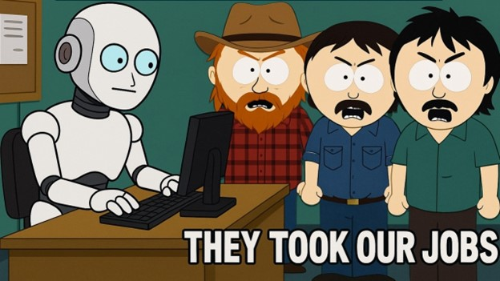

# Eco-friendly AIs
There’s a division amongst people regarding the use of AIs. Some praise its efficiency and usefulness, while others absolutely hate it. There are many reasons to dislike AI.

- **Ethical Reasons:** Many models are trained on stolen data.
- **Replacing Humans:** Layoffs have already occurred at many companies as work normally done by humans is replaced by AI.

Credit: [South Park](https://southpark.cc.com/)

- **Sycophantic Behavior:** AI platforms want you to keep asking questions and draw you in. What better way than to stroke your ego and let you think you’re right most of the time?
Environmental Impact: The amount of water it takes to cool data centers and the amount of energy it takes to power them is enormous!

Read more at [GitHub Pages - Eco-friendly AIs](wwwroot/index.html)